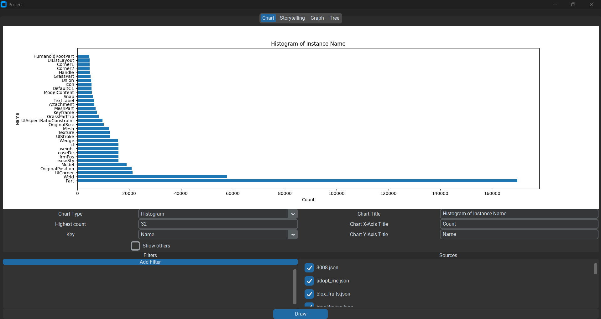
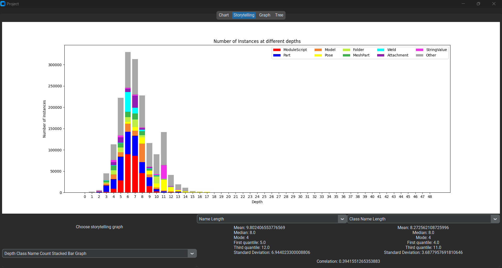
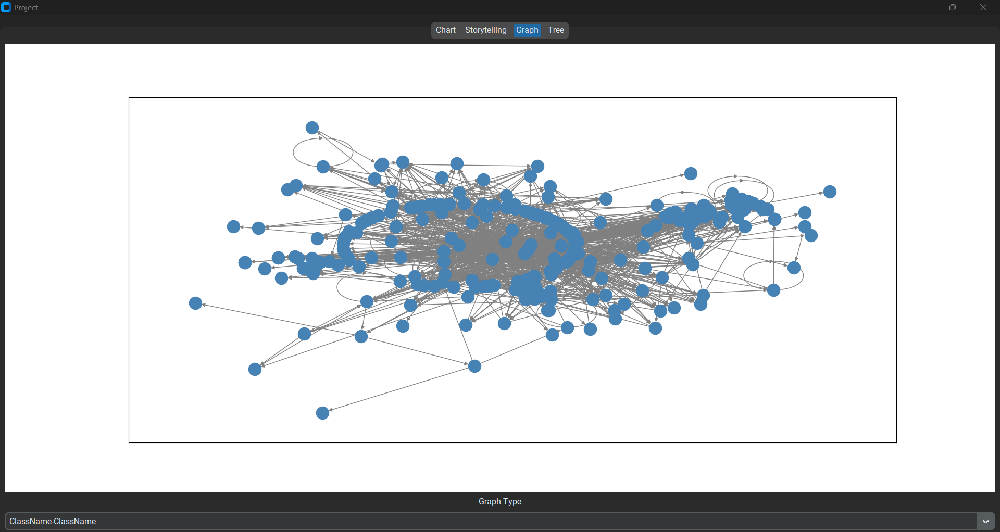
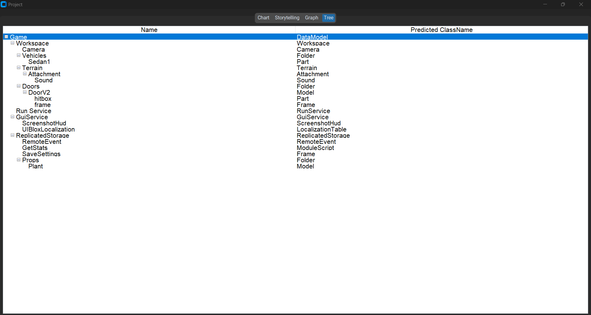

# RBX (Roblox) Class Name Prediction

An application for [Programming II Course](https://classroom.google.com/c/NjUwOTIwOTEzNDgz) course at [Kasetsart University](https://ku.ac.th).

This application is for predicting class name of a datamodel tree where the name is known but the classname isn't, written in Python.

| **Chart Tab**    |   |
|:-----------------|:---------------------|
| **Storytelling Tab**  |  |
| **Graph Tab**  |  |
| **Tree Tab**  |  |

## Requirements

Requires Python 3.11.4.  Required Python packages are listed in [requirements.txt](./requirements.txt). 

## Running the Application

1. Clone the repo `$ git clone https://github.com/Pawat-Sarnchawanakit/year-project.git year-project`  
2. Cd into the directory `$ cd year-project`  
3. Create a virtualenv: `$ python -m venv .venv`  
4. Activate the virtualenv and run `$ pip install -r requirements.txt`  
5. Run the application: `$ python main.py`  